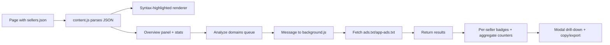

# Sellers.json Inspector

A Chrome Extension that parses, visualizes, and validates `sellers.json` inventory metadata with a fast, in-page inspection and verification workflow.

[](manifest.json)
[](manifest.json)
[](LICENSE)
[](#features)

> [!NOTE]
> This project is implemented as a browser extension focused on `sellers.json` validation workflows. It behaves like an auditing/diagnostics tool for supply-path data rather than a standalone backend library.

## Table of Contents

- [Features](#features)
- [Tech Stack & Architecture](#tech-stack--architecture)
  - [Core Stack](#core-stack)
  - [Project Structure](#project-structure)
  - [Key Design Decisions](#key-design-decisions)
- [Getting Started](#getting-started)
  - [Prerequisites](#prerequisites)
  - [Installation](#installation)
- [Testing](#testing)
- [Deployment](#deployment)
- [Usage](#usage)
- [Configuration](#configuration)
- [License](#license)
- [Contacts & Community Support](#contacts--community-support)

## Features

- Real-time parsing and syntax highlighting of raw `sellers.json` documents in-page.
- Color-customizable JSON tokens (`key`, `string`, `number`, `boolean`) from extension settings.
- Interactive overview panel with seller-level and domain-level aggregate stats.
- Seller-domain deduplication logic for unique domain counting.
- Validation pre-filtering for malformed or missing seller domains.
- Parallelized remote validation against both:
  - `https://<domain>/ads.txt`
  - `https://<domain>/app-ads.txt`
- Badge-level per-seller status rendering (`Ads: OK/NO`, `App: OK/NO`).
- Aggregate anomaly categories:
  - Invalid domain
  - Invalid `ads.txt` line
  - Invalid `app-ads.txt` line
  - Total invalid sellers (not found in both files)
  - Total found sellers (found in at least one file)
- Interactive stat rows with tooltip hints and click-to-filter modal drill-down.
- Export and operator productivity features:
  - Copy filtered JSON subset to clipboard
  - Save filtered subset as `.json`
- Storage-backed runtime preferences via `chrome.storage.local`.
- Background fetch broker with timeout protection for resilient cross-domain checks.

> [!TIP]
> The extension is most useful for SSP/Exchange QA, ad-ops verification, and compliance checks where seller record integrity is critical.

## Tech Stack & Architecture

### Core Stack

- Language: JavaScript (ES6+) + HTML + CSS
- Runtime Platform: Chrome Extension Manifest V3
- Browser APIs:
  - `chrome.storage.local`
  - `chrome.runtime.sendMessage`
  - `chrome.tabs.reload`
- Content processing approach:
  - Parse body text as JSON
  - Replace page body with syntax-highlighted renderer
  - Overlay a fixed analytics panel for domain and seller diagnostics

### Project Structure

```text
Sellers.json-Inspector/
├── background.js      # Service worker, cross-origin fetch relay with timeout
├── content.js         # Main inspection UI logic, parsing, analytics, modal workflow
├── content.css        # Visual system, panel/badge/modal/tooltip styles
├── popup.html         # Extension settings UI
├── popup.js           # Settings persistence and page reload action
├── manifest.json      # Extension metadata, permissions, and script wiring
├── icons/
│   └── icon128.png
└── LICENSE
```

### Key Design Decisions

- **Separation of concerns via extension contexts**:
  - `content.js` handles parsing/rendering and user interactions.
  - `background.js` handles remote fetch execution with abort timeout.
- **Asynchronous fan-out validation**:
  - Seller domain checks are processed in a bounded-concurrency queue (`CONCURRENCY_LIMIT = 10`) to balance speed and network pressure.
- **Stat-centric UX for triage**:
  - The panel surfaces aggregate counters first, then lets operators drill into filtered records.
- **Data-preserving export strategy**:
  - Export payload keeps original top-level network fields and only swaps `sellers` with filtered slices.



> [!IMPORTANT]
> The extension rewrites the visible body content for matching `sellers.json` pages to provide a rich inspection UI.

## Getting Started

### Prerequisites

- Google Chrome (or Chromium-based browser with MV3 extension support)
- Git
- Optional for local quality checks:
  - Node.js 18+ (for custom scripts if you add them)
  - Python 3.8+ (for JSON validation helpers)

### Installation

```bash
git clone <your-fork-or-repo-url>
cd Sellers.json-Inspector
```

Load the extension:

1. Open `chrome://extensions/`.
2. Enable `Developer mode`.
3. Click `Load unpacked`.
4. Select the project root directory.
5. Navigate to any URL matching `*sellers.json*` to activate inspector UI.

> [!WARNING]
> The extension currently requests broad host access (`*://*/*`) to validate remote `ads.txt` and `app-ads.txt` files. Restrict this scope in hardened environments if required.

## Testing

This repository does not include an automated test suite at this time. Use the checks below as a practical validation baseline.

```bash
# Validate extension manifest JSON syntax
python -m json.tool manifest.json >/dev/null

# Find accidental non-English content if you enforce English-only docs/UI
rg -n "[А-Яа-яЁё]" .

# Spot whitespace issues
git diff --check
```

Manual test checklist:

1. Open a valid `sellers.json` page and confirm syntax highlighting appears.
2. Open extension popup, modify colors/toggles, click `Save & Reload`, confirm persistence.
3. Run domain analysis and verify progress bar, badges, and stat counters update.
4. Click stat labels to open modal and validate copy/export actions.

> [!CAUTION]
> Domain verification depends on remote host availability and response latency; some failures may be environmental, not functional defects.

## Deployment

Because this is a browser extension, deployment typically means packaging and publishing to a browser store or distributing a signed zip.

### Production Packaging

```bash
# From repository root
zip -r sellers-json-inspector.zip . -x ".git/*" "*.DS_Store"
```

### CI/CD Integration Guidance

- Add pipeline steps for:
  - JSON validation (`manifest.json`)
  - static checks (optional ESLint/Prettier if introduced)
  - artifact packaging (`zip`)
- Store signing credentials in secure CI secrets.
- Gate releases with semantic version bumps in `manifest.json`.

### Containerization Note

A Docker runtime is typically unnecessary for client-side extension packaging, but CI containers can be used for deterministic lint/package tasks.

## Usage

### 1) Open and Inspect a `sellers.json` Endpoint

- Navigate to a matching endpoint such as:
  - `https://example.com/sellers.json`
- The extension auto-renders an enhanced inspection interface.

### 2) Configure Inspector Preferences

Use the popup to set display behavior and visual palette.

```js
// popup.js (runtime behavior example)
chrome.storage.local.get(defaults, (cfg) => {
  // Applies persisted options to popup controls
});

chrome.storage.local.set(newConfig, () => {
  // Persists options then reloads active tab
  chrome.tabs.query({ active: true, currentWindow: true }, (tabs) => {
    chrome.tabs.reload(tabs[0].id);
  });
});
```

### 3) Run Domain Validation Pipeline

```js
// content.js (queue-driven checks)
const [adsText, appAdsText] = await Promise.all([
  fetchFromBackground(`https://${sellerObj.domain}/ads.txt`),
  fetchFromBackground(`https://${sellerObj.domain}/app-ads.txt`)
]);

const hasAds = adsText && adsText.includes(sellerObj.seller_id);
const hasAppAds = appAdsText && appAdsText.includes(sellerObj.seller_id);
```

### 4) Drill into Category Results

- Click a stat label to open filtered JSON.
- Use `Copy to Clipboard` for quick sharing.
- Use `Save .json` for offline analysis or ticket attachments.

## Configuration

Configuration is persisted in `chrome.storage.local` and controlled through the popup UI.

### Available Options

| Key | Type | Default | Description |
|---|---|---|---|
| `keyColor` | string | `#FF8C00` | JSON key token color. |
| `strColor` | string | `#7bbf8e` | JSON string token color. |
| `numColor` | string | `#F0FFF0` | JSON numeric token color. |
| `boolColor` | string | `#F0FFF0` | JSON boolean/null token color. |
| `showPanel` | boolean | `true` | Show/hide the right-side overview panel. |
| `showTotalSellers` | boolean | `true` | Show total seller records stat. |
| `showUniqueSellers` | boolean | `true` | Show unique-domain sellers stat. |
| `showInvalidDomains` | boolean | `true` | Show invalid/missing domain stat. |
| `showInvalidAds` | boolean | `true` | Show missing `ads.txt` match stat. |
| `showInvalidAppAds` | boolean | `true` | Show missing `app-ads.txt` match stat. |
| `showTotalInvalid` | boolean | `true` | Show total invalid (not found in both) stat. |
| `showTotalFound` | boolean | `true` | Show total found (at least one match) stat. |

### Manifest-Level Permissions

- `storage`: persisting extension settings
- `host_permissions: ["*://*/*"]`: requesting remote domain resources for validation

> [!NOTE]
> There is no `.env` file or CLI startup flags in the current implementation. All runtime options are managed through extension UI controls and persisted storage keys.

## License

This project is distributed under the MIT License. See [LICENSE](LICENSE) for full terms.

## Contacts & Community Support

## Support the Project

[](https://www.patreon.com/OstinFCT)
[](https://ko-fi.com/fctostin)
[](https://boosty.to/ostinfct)
[](https://www.youtube.com/@FCT-Ostin)
[](https://t.me/FCTostin)

If you find this tool useful, consider leaving a star on GitHub or supporting the author directly.
